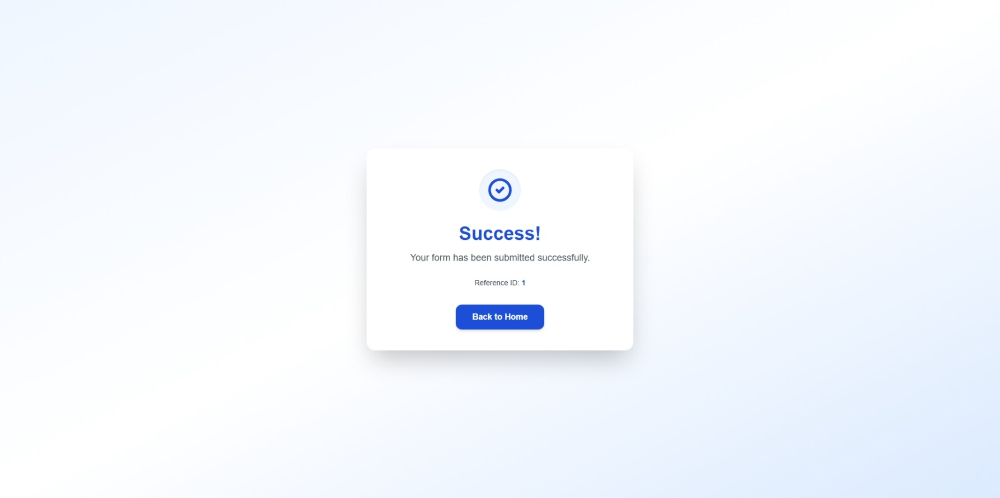
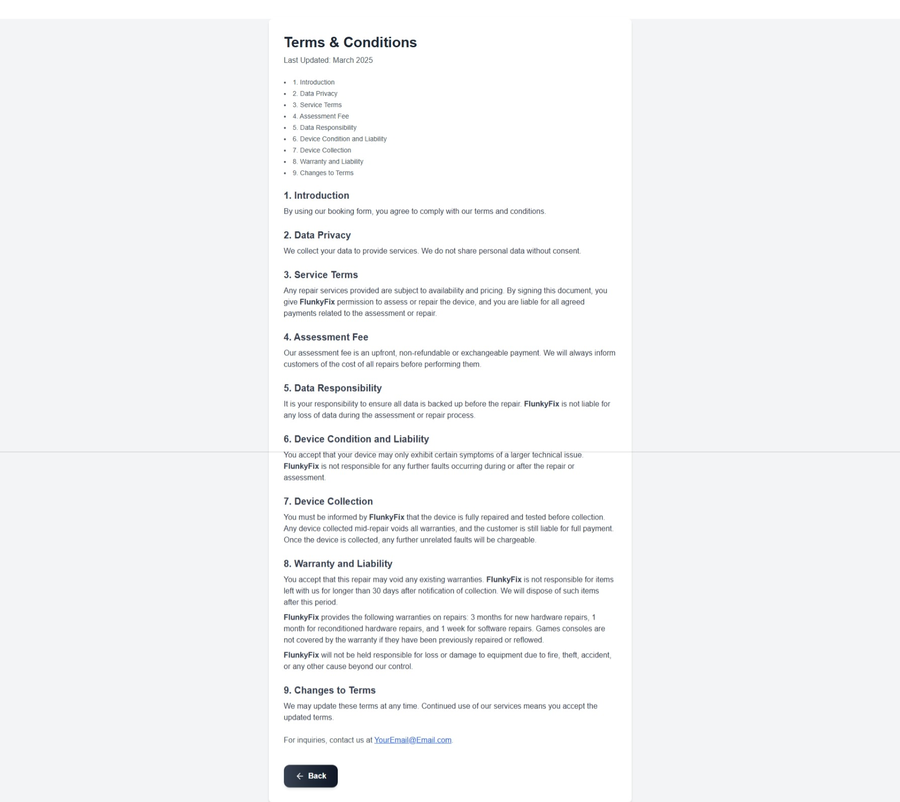

# 🧩 TechRepair Booking Form 

[](https://nextjs.org/)
[](https://www.typescriptlang.org/)
[](https://tailwindcss.com/)
[](https://nodejs.org/)

## 🖼️ Preview

<p align="center">
  
  <br/>
  
  <br/>
  
  <br/>
  
</p>


A full-stack booking system built with **Next.js**, **TypeScript**, and **Node.js + MySQL**, designed for repair shops or service-based businesses.

This project demonstrates modern frontend architecture, reusable React components, modular backend APIs, and real-world environment configuration tooling — all production-ready.

---

## 🚀 Features

✅ Responsive, animated **Next.js 15** frontend  
✅ Modular **Express + MySQL** backend  
✅ Smart `.env` setup wizard with database bootstrap  
✅ Persistent form state with `localStorage`  
✅ Custom booking flow with job reservation & cancellation  
✅ Animated success screen + dynamic job ID reference  
✅ Fully modularized React component structure  
✅ Reusable form elements with consistent UI/UX  
✅ Environment variable validation and error display  
✅ Optional SSL + SMTP configuration built in

---

## 🧠 Tech Stack

### Frontend
- [Next.js 15 (App Router)](https://nextjs.org/)
- [TypeScript](https://www.typescriptlang.org/)
- [TailwindCSS](https://tailwindcss.com/)
- [Framer Motion](https://www.framer.com/motion/)
- [Lucide Icons](https://lucide.dev/)

### Backend
- [Express](https://expressjs.com/)
- [MySQL2](https://github.com/sidorares/node-mysql2)
- [Axios](https://axios-http.com/)
- [dotenv](https://www.npmjs.com/package/dotenv)

### Tooling
- Custom setup wizard (`scripts/setup-env.mjs`)
- ESLint + Prettier formatting
- Nodemon for backend dev
- Cross-platform scripts for local dev

---

## ⚙️ Setup Instructions

### 1️⃣ Clone the repository:

```bash
git clone https://github.com/yourusername/techease-booking-portal.git
cd techease-booking-portal
```

### 2️⃣ Install Dependencies

From the project root directory, Run:

```bash
npm install
```

### 3️⃣ Run the Setup Wizard

The setup wizard will:

- Create `.env` files for **frontend** and **backend**
- Ask for your **business name**, **API URL**, and **database credentials**
- (Optionally) **create your database and tables** using the included `schema.sql`
- (Optionally) **set up email (SMTP)**

Run it with:

```bash
npm run setup
```

### 4️⃣ Start the dev servers

Run:
```bash
npm run dev
```

---
## 🧾 License
MIT License — free to use and modify for educational or portfolio purposes.
