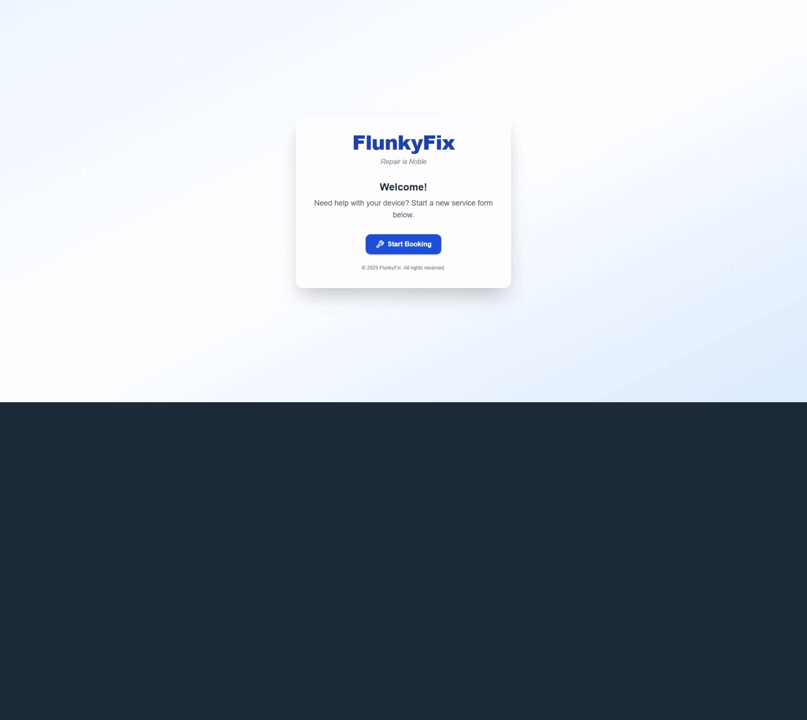

# 🧩 TechRepair Booking Form 

[](https://nextjs.org/)
[](https://www.typescriptlang.org/)
[](https://tailwindcss.com/)
[](https://nodejs.org/)

## 🖼️ Preview

*(Demo branding: FlunkyFix — “Repair is Noble.” — customizable via `.env`)*

<p align="center">
  
</p>


A full-stack booking system built with **Next.js**, **TypeScript**, and **Node.js + MySQL**, designed specifically for repair shops, inspired from experience within the industry. 

This project demonstrates modern frontend architecture, reusable React components, modular backend APIs, and real-world environment configuration tooling — all production-ready.

---

## Features

- Responsive, animated Next.js 15 frontend built for performance
- Modular Express + MySQL backend with clean API design
- Smart .env setup wizard — generates config and initializes your database
- Automated email confirmation system (via SMTP integration)
- Persistent form data storage using localStorage
- Dynamic job reservation and cancellation system
- Animated success screen with unique job reference ID
- Fully modularized, reusable React components
- Consistent and accessible UI/UX built with TailwindCSS
- Built-in environment validation with helpful error screens
- Optional SSL for secure deployments

---

## Tech Stack

### Frontend
- [Next.js 15 (App Router)](https://nextjs.org/)
- [TypeScript](https://www.typescriptlang.org/)
- [TailwindCSS](https://tailwindcss.com/)
- [Framer Motion](https://www.framer.com/motion/)
- [Lucide Icons](https://lucide.dev/)

### Backend
- [Express](https://expressjs.com/)
- [MySQL2](https://github.com/sidorares/node-mysql2)
- [Axios](https://axios-http.com/)
- [dotenv](https://www.npmjs.com/package/dotenv)

### Tooling
- Custom setup wizard (`scripts/setup-env.mjs`)
- ESLint + Prettier formatting
- Nodemon for backend dev
- Cross-platform scripts for local dev

---

## ⚙️ Setup Instructions

### 1️ Clone the repository:

```bash
git clone https://github.com/Bankableflunky5/Booking-in-Form.git
cd Booking-in-Form
```

### 2️ Install Dependencies

From the project root directory, Run:

```bash
npm install
```

### 3️ Run the Setup Wizard

The setup wizard will:

- Create `.env` files for **frontend** and **backend**
- Ask for your **business name**, **API URL**, and **database credentials**
- (Optionally) **create your database and tables** using the included `schema.sql`
- (Optionally) **set up email (SMTP)**

Run it with:

```bash
npm run setup
```

### 4️ Start the dev servers

Run:
```bash
npm run dev
```

---
## 🧾 License
MIT License — Use it however you want
